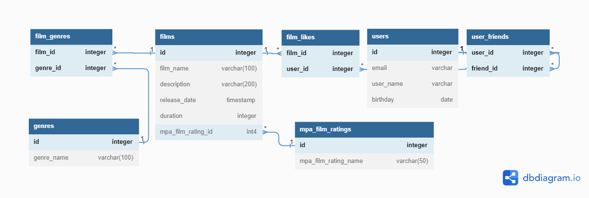

# java-filmorate
## ER Diagram (https://dbdiagram.io/d/6414ac1e296d97641d88d727)

## SQL Examples
### 1. Get films
```
SELECT *
FROM film
```
### 2. Get film by id
```
SELECT *
FROM film
WHERE id = &id
```
### 3. Add film
```
INSERT INTO film (name, description, release_date, duration, rating_id)
VALUES (&name, &description, &release_date, &duration, &rating_id)
```
### 4. Get users
```
SELECT *
FROM user
```
### 5. Get user by id
```
SELECT *
FROM user
WHERE id = &id
```
### 6. Add user
```
INSERT INTO user (email, login, name, birthday)
VALUES (&email, &login, &name, &birthday)
```
### 7. Get user friends
```
SELECT friend_id
FROM friendship
WHERE user_id = &user_id and confirmed
```
