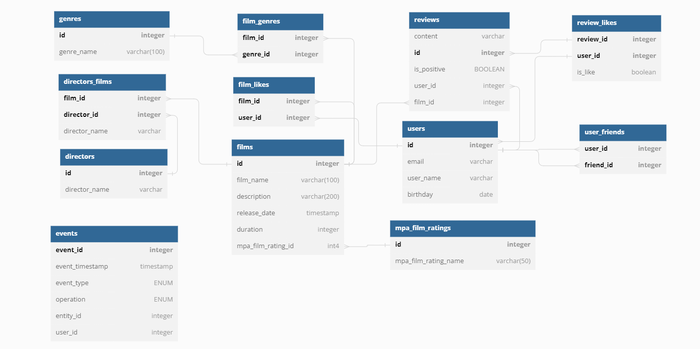

# java-filmorate
## ER Diagram (https://dbdiagram.io/d/6428102d5758ac5f1725ebc5)

## SQL Examples
### 1. Get films
```
SELECT *
FROM films
```
### 2. Get film by id
```
SELECT *
FROM films
WHERE id = :id
```
### 3. Add film
```
INSERT INTO films (film_name, description, release_date, duration, mpa_film_rating_id)
VALUES (:film_name, :description, :release_date, :duration, :mpa_film_rating_id)
```
### 4. Get users
```
SELECT *
FROM users
```
### 5. Get user by id
```
SELECT *
FROM users
WHERE id = &id
```
### 6. Add user
```
INSERT INTO users (email, login, user_name, birthday)
VALUES (:email, :login, :user_name, :birthday)
```
### 7. Get user friends
```
SELECT friend_id
FROM user_friends
WHERE user_id = :user_id
```
